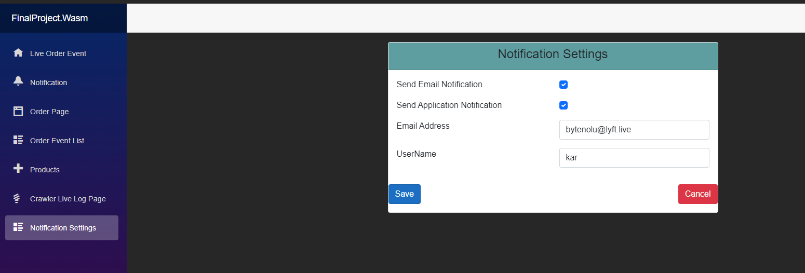

Commerce Data Crawler with Selenium and SignalR in C#

Project Description:

In this project it is aimed to build a web crawler application with **Selenium Framework** in dotnet **entity framework core** and with real time communication by **SignalR.**

**CQRS and MediatR** are applied features as well.

There are different projects combined in a solution. You can find brief information about them as below.

Crawling Console Application:

In this project a data crawler console application is built in c-# with Selenium framework.This application program uses **Selenium framework** for crawling.

A given web page is scraped according to the criteria that are asked to the user. The user is asked If he/she wants to crawl all products or a number of them. The second question in the console is if he/she wants all products, only discounted ones or only ones that is not discounted.

After these selections crawler starts and acts according the given parameters.

Whenever it starts, an order and an order-event are created in the database. During crawling other status of the order is added to the order-event table.

Later after crawling ends, the requested quantity of products or sometimes available number of them is added to the product table.

**.Net EntityFramework Core 7:**

The clean architecture is used here. Domain, Application and Infrastructure layers are created.

In Domain layer order, order-event, product are entities. Most interfaces and services are in application layer. In Infrastructure we have persistence and database table creation configuration files.

**Wasm project:**

In this part Blazor web application is used. There pages for the order, order-events, products, notification-setting. The realtime live pages are also available.

Live

Tha above page is a live stream from SignalR.

The left handside retrieves data from database by httpclient, where the right handside is the current crawling with SignalR hub.

Crawler Live Log Page

Notification settings page, added/updated and according to this settings application message or email is sent to the user.

If application notification is selected, then there will be a message on Page Notification.

**Web api:**

